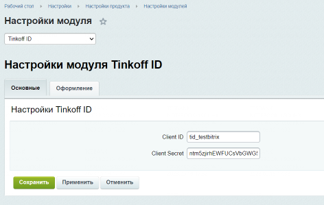

# Tinkoff ID Bitrix

# Бизнес описание продукта

Модуль Tinkoff ID для Bitrix позволяет легко и быстро подключить на ваш сайт полноценный функционал нашего сервиса, включающий в себя:

- отображение нашей кнопки на интерфейсе;
- обмен backend данными;
- запрос данных пользователей согласно вашим бизнес-потребностям.

# Сценарий использования.
1. Напишите на почту tinkoff_id@tinkoff.ru. В письме укажите, что хотите подключить модуль Tinkoff ID Bitrix — в ответ мы пришлем документы для ознакомления.
2. Подпишите заявление на подключение и заполните техническую анкету. Отправьте документы, как вам удобно: курьером, ответным письмом по эл. почте или через ЭДО.
3. Подключите наш плагин Bitrix. Если у вас возникнут вопросы, можно написать нам на почту технической поддержки acq_help@tinkoff.ru — поможем разобраться.

# Техническое описание продукта.

## Подключение модуля.
- Для начала работы с модулем вам требуется на сервере с развернутым CMS Bitrix создать папку с названием: `tinkoffid`
- Далее требуется скачать в созданную папку исходные файлы из репозитория [банка](https://github.com/Tinkoff/tinkoff-id/tree/master/tinkoff-auth).
- Войдите в режим "Администрирования" сайта (http://ВАШ_САЙТ/bitrix/admin/) и в разделе "Настройки" > "Настройки продукта" > "Настройки модулей" и выберете "Tinkoff ID".

- В открывшейся форме требуется указать полученный вами от менеджера банка client_id и client_secret.
- По желанию вы можете перейти на вкладку "Оформление" для правки визуальной составляющей кнопки.

## Публикация кнопки

Для вывода кнопки на сайте, необходимо в компонентах внутри темы Bitrix в требуемом месте разместить следующий код модуля:

`<?php $APPLICATION->IncludeComponent("tinkoff:id.button","",);?>`