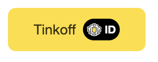
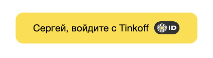

# Tinkoff ID Widget Button

# Бизнес описание продукта

Tinkoff ID Widget Button представляет собой кнопку, которая встраивается на сайт партнера одной строчкой кода.

У данного решения есть следующие преимущества:

- Не требуется разработки механизма авторизации на frontend;
- Не требуется верстать саму кнопку;
- Партнёр легко выполняет настройку дизайна кнопки с учетом строгих требований к [стайлгайдам](https://acdn.tinkoff.ru/static/documents/tinkoff-id-button-placement-guidelines.pdf) банка;
- Партнёр может получать данные по аналитике виджета: нажатие на кнопку, прохождение форм авторизации, время затраченное на авторизацию и иные данные, которые банк отслеживает на своей стороне.

*Более детальное описание решения доступно по [ссылке](https://www.tinkoff.ru/corporate/business-solutions/open-api/tinkoff-id/integration/instruction/).*

## Сценарий использования.
Партнёр реализует интеграцию с банками на своём сайте в части авторизации клиентов для ускорения и упрощения их пути от входа до получения сервиса\покупки, Tinkoff ID полностью закрывает данную потребность в том числе предлагает конкурентное преимущество, так как продукт частично разработан на стороне банка.

# Техническое описание продукта.

## Рекомендации по интеграции Tinkoff ID
Прежде, чем преступить к добавлению кнопки на сайте, рекомендуем ознакомиться с [Рекомендации по интеграции Tinkoff ID](https://www.tinkoff.ru/corporate/business-solutions/open-api/tinkoff-id/integration/instruction/)

## Подключение библиотеки на сайте
Для подключения на сайте необходимо вставить в блок **head** следующий скрипт:
```html
<script src="https://business.cdn-tinkoff.ru/static/projects/tinkoff-id/widget.js"></script>
```

## Пример инициализации скрипта
```javascript
const authParams = {
  redirectUri: 'https://mysite.ru/auth/success',
  responseType: 'code',
  scopeParameters: '',
  clientId: 'XXXX',
  state: 'XXXX'
}

const uiParams = {
  container: '#container-for-tid-button',
  size: 'm',
  color: 'primary',
  text: 'Tinkoff',
  target: '_self'
}

const tidSdk = new TidSDK(authParams);

tidSdk.addButton(uiParams);
```




## Описание параметров
### Auth Params
  - **redirectUri** `string` - Uri, на который будет перенаправлен клиент после завершения авторизационного диалога
  - **responseType** `string` - Определяет какой авторизационный процесс будет запущен и какие параметры будут переданы по завершению авторизации
  - **scopeParameters** `string` (необязательный параметр) - Набор данных, указанный партнером в технической анкете
  - **clientId** `string` - Идентификатор клиента (приложения)
  - **state** `string` - Строка, генерируемая на стороне клиента для связи контекста запуска авторизации с завершением

### UI Params
  - **container** `string` | `HTMLElement` - элемент-контейнер, внутри которого располагается кнопка. Пример: `#container`, `.container` или же сам элемент
  - **size** `xs` | `s` | `m` | `l` - размер кнопки
  - **color** `primary` | `black` | `grey` | `business` - цвет кнопки
  - **text** `string` (необязательный параметр, по умолчанию используется "Войти с Тинькофф") - текст слева от логотипа
  - **target** `_parent` | `_self` | `_blank` | `_top` (необязательный параметр, по умолчанию используется `_blank`) - определеяет, в каком окне будет открываться форма авторизации. Если необходимо открывать окно вместо текущей вкладки, используйте `_self`
  - **recognized** `true` | `false` (необязательный параметр, по умолчанию используется `false`) - флаг, позволяющий включать распознавание имени пользователя

#### recognized: true
В случае, если передано значение `recognized: true` и мы смогли распознать пользователя, то у кнопки изменится текст. Также необходимо блоку-контейнеру, куда встраивается кнопка, задать максимальную ширину, так как кнопка растягивается на 100% по ширине.

 

## FAQ
### Кнопка отображается не так, как хотелось бы
Для кастомизации кнопки под свой дизайн, можно переопределить стили кнопки. Для этого в css файле добавьте соответствующие классы.
Например:
```css
.tid-4PNRE-button-primary {
  background-color: red;
}
```
поменяет цвет кнопки на красный