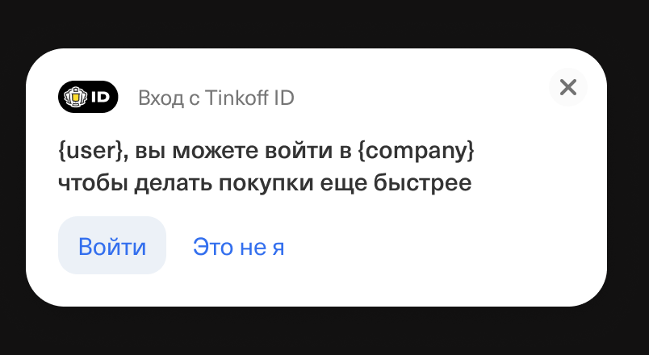

# Tinkoff ID Widget Notification

# Бизнес описание продукта.
Widget Notification от Tinkoff ID это всплывающее уведомление (всплывашка), которое распознает пользователя по куке и предлагает войти на сайт партнера через Tinkoff ID.



Сервис обладаем рядом преимуществ для партнёра:

1. Не требуется разработка механизма всплывашки на фронте партнёра, так как это часть уже реализована Tinkoff ID;
2. Нет ложных срабатываний, показывается только тем кого узнали;
3. Пользователь не придется искать кнопку или форму входа
4. Настраиваемый сценарий появления всплывашки:
    * По клику клиента на определенной части сайта;
    * По времени проведенном на сайте клиентом (таймаут);
    * По сценарию прокрутки страницы до определенного места.
5. Настраиваемое расположение всплывашки по 6 зонам на странице:

| Левая ориентация  | Ориентация по центру  | Правая ориентация |
|:------------- |:----------------:|--------------:|
| сверху слева | сверху по центру | сверху справа |
| по центру слева       | по центру экрана | по центру справа  |
| снизу слева       | снизу по центру | снизу справа |


## Сценарий использования.
Партнёр ищет возможность упростить и ускорить вход клиентов на своей сайте и в случае, если ранее на его или на сайте партнеров банка или сайте самого банка Тинькофф ваш клиент совершал авторизацию, то внедрив данное решение, клиент увидит всплывашку на сайте и получает возможность выполнить вход в один клик.

# Техническое описание продукта.

## Подключение библиотеки на сайте
Для подключения на сайте необходимо вставить в блок head следующий скрипт:

```html
<script src="https://business.cdn-tinkoff.ru/static/projects/tinkoff-id/widget.js"></script>
```

Пример инициализации скрипта:
```html
<!DOCTYPE html>
<html lang="ru">
  <head>
    <meta charset="UTF-8">
    <meta http-equiv="X-UA-Compatible" content="IE=edge">
    <meta name="viewport" content="width=device-width, initial-scale=1.0">
    <title>Demo</title>
 
    <script src="https://business.cdn-tinkoff.ru/static/projects/tinkoff-id/widget.js"></script>
  </head>
  <body>

          <button id="button">При клике появится всплывашка</button>

 
        <script>
            const tidSdk = new TidSDK({
                redirectUri: 'https://mysite.ru/auth/success',
                responseType: 'code',
                clientId: 'XXXX',
                state: 'XXXX'
            });
 
            tidSdk.addNotification({
                triggers: {
                  click: {
                    isActive: true,
                    element: '#button',
                  },
                  pageLoad: {
                    isActive: true,
                    delay: 3000,
                  }, 
                  scroll: {
                    isActive: true,
                    offsetY: 10,
                  },
                },
                place: 'bottom-right',
                recognized: true,
                zIndex: 444,
                target: '_blank',
            });
        </script>
    </body>
</html>
```

## Описание параметров
### Auth Params
  - **redirectUri** `string` - Uri, на который будет перенаправлен клиент после завершения авторизационного диалога
  - **responseType** `string` - Определяет какой авторизационный процесс будет запущен и какие параметры будут переданы по завершению авторизации
  - **clientId** `string` - Идентификатор клиента (приложения)
  - **state** `string` - Строка, генерируемая на стороне клиента для связи контекста запуска авторизации с завершением

### UI Params
- **triggers** – объект с тремя видами триггеров появления уведомления
  - **click**: {
    - **isActive** `boolean` – отвечает за активацию триггера
    - **element**: `HTMLElement` | `string` - элемент, на который вешается клик
  }
  - **pageLoad**: {
    - **isActive** `boolean` – отвечает за активацию триггера
    - **delay** `number` - количество миллисекунд, по истечении которых покажется уведомление
  }
  - **scroll**: {
    - **isActive** `boolean` – отвечает за активацию триггера
    - **offsetY** `number` - процент прокрутки вниз, по достижению которого появится уведомление. Принимаемые значения от 0 до 100
  }
  - **place** `top-left`, `top-mid`, `top-right`, `left-mid`, `right-mid`, `bottom-left`, `bottom-mid`, `bottom-right` - место, в котором отображается уведомление
  - **recognized** `boolean` – уведомление покажется в том случае, если смогли распознать пользователя
  - **zIndex** `number` (необязательный параметр, по умолчанию используется 99999) – уровень наложения уведомления в верстке, значение от 0 до 99999
  - **target** `_parent` | `_self` | `_blank` | `_top` (необязательный параметр, по умолчанию используется _blank) - определеяет, в каком окне будет открываться форма авторизации. Если необходимо открывать окно вместо текущей вкладки, используйте `_self`