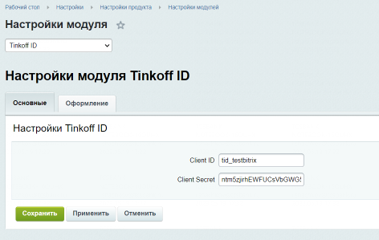

# Tinkoff ID Bitrix

# Бизнес описание продукта

Плагин Tinkoff ID для WordPress позволяет легко и быстро подключить на ваш сайт полноценный функционал нашего сервиса, включающий в себя:
- отображение нашей кнопки на интерфейсе;
- обмен backend данными;
- запрос данных пользователей согласно вашим бизнес-потребностям.

# Сценарий использования.
1. Напишите на почту tinkoff_id@tinkoff.ru. В письме eкажите, что хотите подключить плагин Tinkoff ID WordPress — в ответ мы пришлем документы для ознакомления.
2. Подпишите заявление на подключение и заполните техническую анкету. Отправьте документы, как вам удобно: курьером, ответным письмом по эл. почте или через ЭДО.
3. Подключите наш плагин WordPress. Если у вас возникнут вопросы, можно написать нам на почту технической поддержки acq_help@tinkoff.ru — поможем разобраться.

# Техническое описание продукта.

## Подключение плагина.
- Для начала работы на сервере с развернутым CMS WordPress создаем папку для будущего плагина.
- Далее в папку требуется скачать исходные файлы из репозитория [банка](https://github.com/Tinkoff/tinkoff-id/tree/master/tinkoff-auth).
- Войдите в режим "Администрирования" сайта (http://ВАШ_САЙТ/wp-admin/)
- Нажмите кнопку в разделе "Плагины" > "Добавить новый" > "Загрузить плагин" > "Выберите файл"

- В открывшемся окне выберете ранее загруженный плагин с "Tinkoff ID".
- Далее для настройки интеграции с банком перейдите в раздел "Плагины" > "Тинькофф ID".
- В открывшемся окне требуется указать полученный вами от менеджера client_id и client_secret
- По желанию вы можете настроить иные параметры отображения кнопки в разделе "Настройки кнопки" .

## Публикация кнопки

Для вывода кнопки, можно использовать шорткод `[tinkoff-button]`, либо настроить вывод в стандартные места темы через настройки.